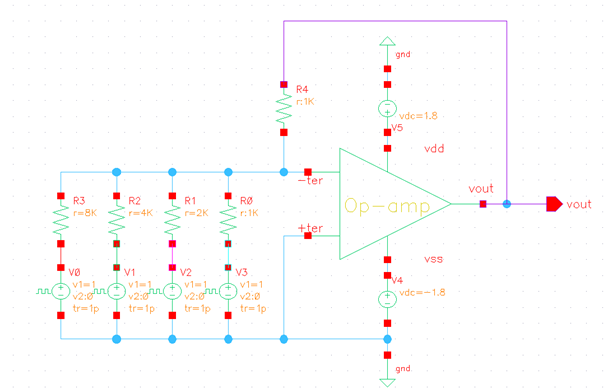
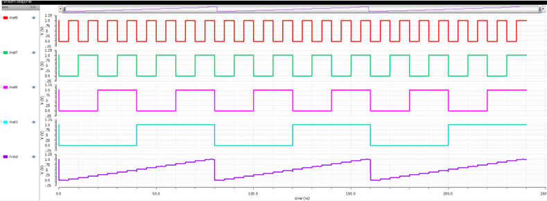
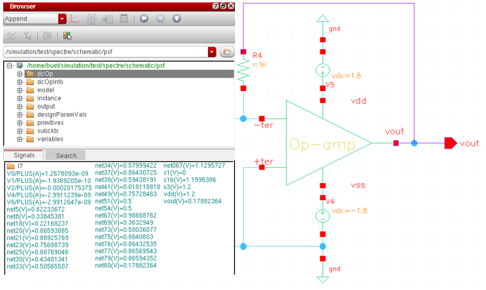

# R2R-DAC-Design
8-bit R-2R ladder DAC designed in CMOS using Cadence with monotonic output, ~7.03 mV resolution, and low power (~0.25 mW)
# 🎯 8-bit R-2R Ladder DAC Design

---

## 📌 Overview
This project presents the design and simulation of an **8-bit R-2R Ladder Digital-to-Analog Converter (DAC)** using CMOS technology.  
The design focuses on achieving **accurate analog output, monotonic behavior, and low power consumption**.

---

## 🎯 Specifications
| Parameter | Value |
|----------|------|
| Resolution | 8-bit |
| LSB Voltage | ~7.03 mV |
| Power Consumption | ~0.25 mW |
| Technology | CMOS |

---

## 🛠 Tools Used
- Cadence Virtuoso  
- LTSpice  

---

## ⚙️ Design Architecture
- Implemented **R-2R resistor ladder network**
- Digital input converted to analog output using switching network
- Designed for **monotonic output behavior**
- Optimized for **low power consumption**

---

## 📊 Results

### 🔹 Schematic

---

### 🔹 Output Waveform

---

### 🔹 Power Analysis

---

## 📘 Project Report
📄 [Click here to view detailed report](DAC_PROJECT_REPORT.pdf)

---

## 🧠 Key Learnings
- Understanding of **DAC operation and R-2R ladder principle**
- Concepts of **resolution, INL, DNL, and linearity**
- Experience in **mixed-signal circuit design**
- Practical exposure to **simulation and performance analysis**
- Importance of **power optimization in CMOS circuits**

---

## 🚀 Future Scope
- Perform detailed **INL/DNL analysis**
- Improve **linearity and accuracy**
- Implement **layout design and parasitic extraction**
- Explore higher resolution DAC architectures

---

## 👨‍💻 Author
**K L V N Rajkumar**  
Aspiring Analog Layout Engineer | VLSI Enthusiast

---

## ⭐ If you like this project
Give it a ⭐ on GitHub and connect with me!
